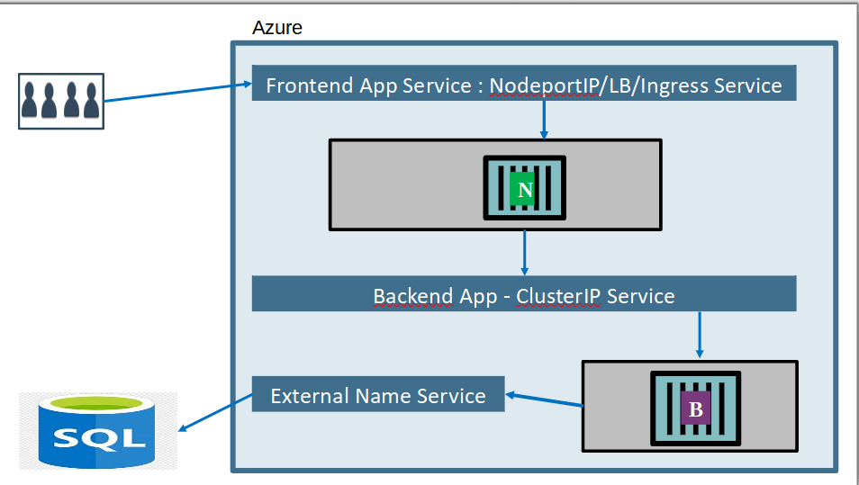

###Challenge1
-----------------------------------------------------------------
# 3 Tier Application Setup

This guide outlines the steps to set up a 3-tier application architecture on Kubernetes, consisting of an Application Tier, Logic Tier, and Database Tier.

## 1) Application Tier

- Choose your incoming traffic gateways, such as NodePort, LoadBalancer, or Ingress, to manage traffic flow to the cluster.
- Deploy a frontend application using the Nginx image. 
  - Create a Deployment for the frontend application and deploy it on Kubernetes.

## 2) Logic Tier

- Deploy a backend application using Python, Java, or .Net.
  - Create a Deployment for the backend application and deploy it on Kubernetes.
- Establish connectivity between the backend application and the frontend application via Cluster IP Service.

## 3) Database Tier

- Set up an Azure SQL databae
- Establish connectivity between the server and the backend application using External Name Service.

##  Archetectuer



###Challenge2
--------------------------------------------------------------------------
# Azure VM Metadata Importer

This Python script retrieves metadata of a virtual machine (VM) from Azure and allows you to save it in a JSON file. You can also query specific metadata keys.

## Requirements

- Python 3.x
- Azure SDK for Python (`azure-mgmt-compute`)
- Azure Identity library (`azure-identity`)

## Installation

1. Ensure you have Python 3.x installed on your system.
2. Install the required Python packages using pip:
    ```bash
    pip install azure-mgmt-compute azure-identity
    ```
3. Clone or download this repository.

## Usage

1. Import the script functions into your Python code or use the provided `main.py` script.
2. Update the variables `subscription_id`, `resource_group_name`, and `vm_name` in the `main()` function with your Azure subscription ID, resource group name, and VM name respectively.
3. Run the script:
    ```bash
    python main.py
    ```
4. Follow the prompts to save the VM metadata and query specific keys.

## Functions

### `get_vm_metadata(subscription_id, resource_group_name, vm_name)`

This function retrieves metadata of the specified virtual machine from Azure.

- `subscription_id`: Azure subscription ID.
- `resource_group_name`: Name of the resource group where the VM is located.
- `vm_name`: Name of the virtual machine.

### `save_metadata(metadata)`

This function saves the VM metadata to a JSON file named `metadata.json`.

- `metadata`: Metadata of the virtual machine obtained from `get_vm_metadata` function.

### `query_vm_metadata(metadata, key)`

This function queries a specific key from the VM metadata.

- `metadata`: Metadata of the virtual machine obtained from `get_vm_metadata` function.
- `key`: Key to query from the metadata.

## Output Scenarios

### Successful Metadata Retrieval and Saving

```bash
VM metadata has been stored in metadata.json
```

### Querying Specific Metadata Key

```bash
Enter the key you want to query: osProfile
{
    osProfile": {
            "computerName": "Windowsrdpterra",
            "adminUsername": "sumer",
            "windowsConfiguration": {
                "provisionVMAgent": true,
                "enableAutomaticUpdates": true,
                "patchSettings": {
                    "patchMode": "AutomaticByOS",
                    "enableHotpatching": false,
                    "assessmentMode": "ImageDefault"
                },
                "enableVMAgentPlatformUpdates": false
            },
            "secrets": [],
            "allowExtensionOperations": true,
            "requireGuestProvisionSignal": true
        },
}
```

###Challenge3
------------------------------------------------------------


# Get Value from Nested Object

This function allows you to retrieve a value from a nested dictionary using a key path.

## Usage

```python
from utils import get_value_from_nested_object

obj1 = {"a": {"b": {"c": "d"}}}
key1 = "a/b/c"
print(get_value_from_nested_object(obj1, key1))  # Output: d

obj2 = {"x": {"y": {"z": "a"}}}
key2 = "x/y/z"
print(get_value_from_nested_object(obj2, key2))  # Output: a
```

## Function Signature

```python
def get_value_from_nested_object(obj, key):
```

## Parameters

- `obj` : The nested dictionary from which to retrieve the value.
- `key` : The key path separated by '/' indicating the nested structure.

## Return Value

- Returns the value corresponding to the provided key path if found in the nested dictionary.
- Returns `None` if the key path is not found or encounters a `KeyError` or `TypeError` during traversal.

## Example

```python
obj = {"a": {"b": {"c": "d"}}}
key = "a/b/c"
print(get_value_from_nested_object(obj, key))  # Output: d
```


